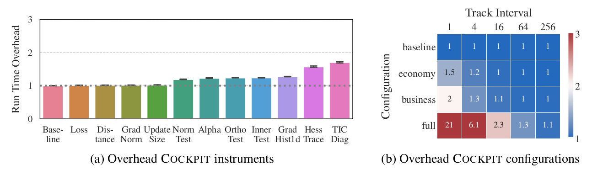

# Instructions to reproduce this benchmark

## (a) Overhead of individual quantities

1. Run experiment: `python run_individual.py`. Alternatively, extract original data: `unzip results_individual.zip` into the `results` directory.
2. Create plots and move them to the tex directory: `python plot_individual.py`.
   Plots can be found in `output/fig_individual`.
3. Clean up or start over: `bash clean_individual.sh`

## (b) Overhead of configurations at different tracking rates

1. Run experiment: `python run_grid.py` and `python run_grid_imagenet.py`. Alternatively, extract original data: `unzip results_grid.zip` into the `results` directory.
2. Create plots and move them to the tex directory: `python plot_grid.py`. Plots
   can be found in `output/fig_grid`.
3. Clean up or start over: `bash clean_grid.sh`
